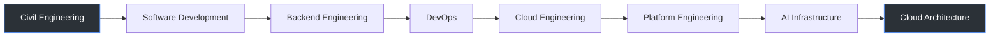
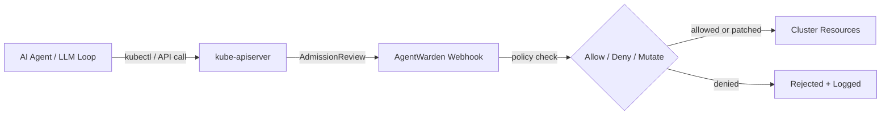
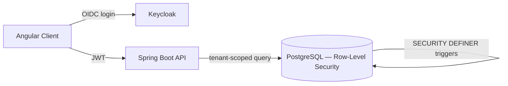
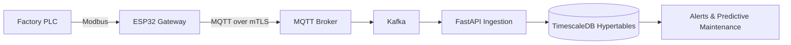

<!--
  Ibrahim El Othmani — GitHub Profile README
  Repository: ibrahimelothmani/ibrahimelothmani
  Last structural revision: see git history
-->

<picture>
  <source media="(prefers-color-scheme: dark)" srcset="https://capsule-render.vercel.app/api?type=waving&color=0:0F1220,100:1E3A5F&height=200&section=header&text=Ibrahim%20El%20Othmani&fontSize=40&fontColor=E6EDF3&animation=fadeIn&fontAlignY=36&desc=Full%20Stack%20%C2%B7%20DevSecOps%20%C2%B7%20Cloud%20%C2%B7%20AI%20Infrastructure&descAlignY=54&descSize=16&descColor=9FB3C8">
  
</picture>

 

<b>Nabeul, Tunisia</b> · Open to remote — France · Belgium · Switzerland · MENA

  

 

 

<a href="#about">About</a> ·
<a href="#engineering-philosophy">Philosophy</a> ·
<a href="#engineering-journey">Journey</a> ·
<a href="#current-focus">Current Focus</a> ·
<a href="#flagship-architectures">Architectures</a> ·
<a href="#featured-projects">Projects</a> ·
<a href="#tech-stack">Stack</a> ·
<a href="#production-experience">Experience</a> ·
<a href="#open-source">Open Source</a> ·
<a href="#learning--certifications">Certifications</a> ·
<a href="#engineering-research">Research</a> ·
<a href="#writing">Writing</a> ·
<a href="#github-activity">Activity</a> ·
<a href="#roadmap">Roadmap</a> ·
<a href="#contact">Contact</a>

 

## About

I didn't start in software. I started in **structural engineering** — calculating load paths, safety factors, and failure margins for concrete and steel. In 2023 I moved into full-stack development and DevOps, and the parallel never stopped being useful: a distributed system and a bridge tend to fail for the same reason — an assumption nobody stress-tested.

Today I build and operate **multi-tenant SaaS platforms and the infrastructure underneath them** — Spring Boot and FastAPI services, Kubernetes clusters, Terraform-managed cloud environments, and the CI/CD and GitOps pipelines that ship them. I'm the founder of **Future Eagle IoT**, where I design industrial IoT and fleet-management systems end to end, from firmware-adjacent data ingestion up to the API and the cluster it runs on.

That same "prove it before you trust it" instinct is what's pulling me toward **AI/ML infrastructure** now — treating agents, RAG pipelines, and model-serving systems as production systems that need the same rigor as anything else in the cluster: versioned, evaluated, access-controlled, and sandboxed, not shipped on faith.

- Based in Nabeul, Tunisia — open to remote roles across **Europe (France, Belgium, Switzerland)** and **MENA**
- Trilingual — English · Français · العربية
- Civil engineer by training, DevSecOps/Cloud engineer by trade
- Currently deep in an AI/ML infrastructure transition — ML foundations through LLM agents, documented as I go

## Engineering Philosophy

> Most incidents aren't caused by bad code. They're caused by an assumption that was never written down, never tested, and quietly broke.

A few things I try to hold myself to:

- **Automate the boring and the dangerous first.** If a step is manual and repeated more than twice, it becomes a script; if it's manual and risky, it becomes a pipeline with a gate.
- **Reliability is a property of the system, not a hope about the code.** Health checks, graceful degradation, and rollback paths are part of the design, not an afterthought bolted on before launch.
- **Security is a default, not a checklist item.** Least-privilege roles, row-level isolation, and short-lived credentials go in from the first migration — retrofitting them later is how breaches happen.
- **If you can't observe it, you don't actually run it.** Metrics, logs, and traces are part of the deliverable, not a "nice to have" for the next sprint.
- **Simplicity is a discipline, not a default.** Boring, well-understood tools beat clever ones almost every time production is on the line.
- **Autonomous systems — including AI agents — get the same trust budget as a new hire:** scoped access, audited actions, and a sandbox until they've earned more.

## Engineering Journey

Started with structural load calculations in 2023 · currently between <b>Platform Engineering</b> and <b>AI Infrastructure</b> · Cloud Architecture is the direction, not a finished stop.

## Current Focus

| Area | In practice |
|---|---|
| **Platform Engineering** | Building internal tooling that constrains what other systems — including AI agents — are allowed to do to a cluster. |
| **Kubernetes & GitOps** | Admission controllers, Helm-packaged services, and ArgoCD-driven deployments instead of `kubectl apply` from a laptop. |
| **Multi-cloud IaC** | Terraform + Ansible across AWS and Azure, aimed at repeatable environments rather than hand-built ones. |
| **Cloud & Application Security** | JWT/OIDC via Keycloak, row-level tenant isolation in PostgreSQL, and shift-left scanning (SonarQube) in the pipeline. |
| **AI/ML Infrastructure** | RAG pipelines, embeddings, and agent sandboxing — applying the same access-control mindset to LLM agents as to any other service account. |
| **Distributed Data Systems** | Kafka-based ingestion and TimescaleDB hypertables for high-volume industrial sensor data. |

## Flagship Architectures

<b>AgentWarden — Kubernetes admission controller for AI coding agents</b>

 

A deterministic security proxy sitting between autonomous AI agents (coding assistants, custom LLM loops) and the Kubernetes resources they try to touch — a validating/mutating admission webhook rather than a wrapper that trusts the agent's own restraint.

**Stack:** Go · Kubernetes admission webhooks · Docker (distroless build)
**Status:** Public repo, Apache-2.0 licensed, CI/CD and test coverage in place
**Why it matters:** as agents get write access to real infrastructure, the access-control layer between "agent suggests" and "agent executes" is the part that actually needs engineering.

<b>Future Eagle Fleet — multi-tenant fleet management SaaS</b>

 

A B2B fleet-management platform built for multiple tenants on shared infrastructure, where tenant isolation is enforced by the database itself rather than by application-layer trust.

**Stack:** Spring Boot · PostgreSQL (Row-Level Security) · Angular · Keycloak
**Status:** Private — proprietary Future Eagle IoT product
**Why it matters:** RLS policies, `SECURITY DEFINER` triggers, and least-privilege DB roles mean a bug in application code can't leak one tenant's data to another — the isolation doesn't depend on every query getting it right.

<b>Eagle IoT — industrial IoT ingestion & monitoring platform</b>

 

An industrial data pipeline running from PLC-connected sensors through to a time-series store built for high-cardinality factory data.

**Stack:** FastAPI · TimescaleDB · ESP32 · MQTT (mTLS) · Kafka
**Status:** Private — proprietary Future Eagle IoT product
**Why it matters:** a ~50-table multi-tenant schema across factories, machines, sensors, alerts, and maintenance, with Kafka absorbing bursty multi-machine telemetry so ingestion doesn't fall over during a factory's peak load.

## Featured Projects

<b>AgentWarden</b> — AI agent sandboxing for Kubernetes

 

  

A Kubernetes admission controller and sandbox purpose-built to constrain what autonomous AI coding agents and LLM-driven tools can do inside a cluster — policy enforcement at the API server rather than trust in the agent's own guardrails.

- **Repo:** [ibrahimelothmani/AgentWarden](https://github.com/ibrahimelothmani/AgentWarden)
- **Tech:** Go, Kubernetes admission webhooks, distroless Docker image
- **Notable:** built directly from a written spec, with CI/CD and test coverage rather than as an afterthought
- **Challenge:** admission webhooks fail closed by design — getting the policy model expressive enough to be useful without becoming a second thing that blocks deploys
- **Status:** actively maintained, Apache-2.0

<b>FlexTier</b> — dual-path legacy Java modernization on AWS

 

  

Takes a legacy Java WAR and migrates it two different ways in parallel — a cost-optimized single-node K3s cluster and a Multi-AZ ECS Fargate deployment — with FinOps tagging so the cost trade-off between the two paths is measurable, not assumed.

- **Repo:** [FlexTier-DevSecOps-Dual-Architecture...](https://github.com/ibrahimelothmani/FlexTier-DevSecOps-Dual-Architecture-Java-Application-Orchestration-FinOps-on-AWS)
- **Tech:** Java · AWS ECS Fargate · K3s · Ansible · Terraform
- **Why two paths:** modernization advice usually picks one target; this compares a lean self-managed option against a managed one side by side, on the same application.

<b>End-to-End DevSecOps — Three-Tier Kubernetes Project</b>

 

 

A reference pipeline for a three-tier application on EKS, wired from commit to production rollout with shift-left scanning ahead of the deploy gate.

- **Repo:** [End-to-End-DevSecOps-Three-Tier-Project-](https://github.com/ibrahimelothmani/End-to-End-DevSecOps-Three-Tier-Project-)
- **Tech:** Terraform · AWS EKS · ArgoCD · Prometheus · Grafana · Jenkins
- **Pattern:** code commit → security scan → image build → ArgoCD sync → monitored rollout

<b>ticket-forge-devops</b> — event-driven ticketing platform under load

 

 

A sandbox built to work through the hard problems of a real high-traffic ticketing platform — concert or match-day flash sales — where scalability and concurrency correctness matter more than feature count.

- **Repo:** [ticket-forge-devops](https://github.com/ibrahimelothmani/ticket-forge-devops)
- **Focus:** event-driven microservices, concurrency control, resilient cloud infrastructure under spiky demand
- **Companion:** documented in long-form as part of the **TicketForge** writing series

<b>Blog-Platform-CloudOps</b> — full-stack app with the DevOps built in from day one

 

 

A Spring Boot + React blog platform where the point isn't the blog — it's that Docker, Jenkins, Kubernetes, Terraform, Ansible, Prometheus, and Grafana are wired in from the first commit instead of retrofitted later.

- **Repo:** [Blog-Platform-CloudOps](https://github.com/ibrahimelothmani/Blog-Platform-CloudOps)
- **Tech:** Spring Boot · React · Docker · Jenkins · Kubernetes · Terraform · Ansible · Prometheus · Grafana

<b>GitOps-on-k8s-using-ArgoCD</b>

 

 

> "If you're still running `kubectl apply` from your local terminal, you aren't managing a cluster — you're babysitting one."

A working ArgoCD/GitOps setup built around that premise: git as the single source of truth for cluster state, not a human's terminal history.

- **Repo:** [GitOps-on-k8s-using-ArgoCD](https://github.com/ibrahimelothmani/GitOps-on-k8s-using-ArgoCD)
- **Tech:** Kubernetes · ArgoCD · Docker · Apache-2.0

More on the <a href="https://github.com/ibrahimelothmani?tab=repositories">full repositories tab</a>, including AI-agent and monitoring experiments (RAG agent platform with Langchain4J, a Prometheus/Grafana/Alertmanager reference setup, and smaller learning projects).

## Tech Stack

Grouped by where it sits in a system, not alphabetically — badges are shorthand, not the pitch.

**Cloud & Infrastructure** — where things run and how they're provisioned
 

**Containers & Orchestration** — how services are packaged and scheduled
 

**CI/CD & GitOps** — how code becomes a running system
 

**Security & Identity** — how access is controlled, not just checked
 

**Observability** — how a running system explains itself
 

**AI / ML & LLM Infrastructure** — the newest layer, treated with the same rigor as the rest
 

**Languages**
 

**Backend & Frontend**
 

**Databases & Messaging**
 

## Production Experience

What I actually build and operate, not what I've read about:

- **Multi-tenant SaaS backends** with database-enforced tenant isolation (PostgreSQL RLS, `SECURITY DEFINER` triggers, least-privilege roles)
- **Kubernetes platforms**, including a custom admission controller that governs what AI agents are allowed to do to a cluster
- **CI/CD pipelines** across Jenkins, GitHub Actions, and GitLab CI, feeding GitOps rollouts through ArgoCD
- **Multi-cloud infrastructure as code** on AWS and Azure with Terraform and Ansible
- **Identity platforms** — Keycloak-backed OIDC/JWT auth in front of production APIs
- **Observability stacks** — Prometheus, Grafana, and Alertmanager wired into services from the start, not bolted on before an audit
- **Industrial IoT data pipelines** — PLC/ESP32 sensor data through MQTT and Kafka into TimescaleDB, at multi-tenant, multi-factory scale

## Open Source

Selected repositories — starred, license, and last-commit badges above are live and reflect the current repo state rather than a snapshot:

- [AgentWarden](https://github.com/ibrahimelothmani/AgentWarden) — AI agent sandboxing admission controller
- [FlexTier-DevSecOps-Dual-Architecture...](https://github.com/ibrahimelothmani/FlexTier-DevSecOps-Dual-Architecture-Java-Application-Orchestration-FinOps-on-AWS) — dual-path Java modernization
- [Blog-Platform-CloudOps](https://github.com/ibrahimelothmani/Blog-Platform-CloudOps) — full-stack app with DevOps built in
- [ticket-forge-devops](https://github.com/ibrahimelothmani/ticket-forge-devops) — high-concurrency ticketing sandbox
- [GitOps-on-k8s-using-ArgoCD](https://github.com/ibrahimelothmani/GitOps-on-k8s-using-ArgoCD) — GitOps reference setup
- [Multi-Modal-AI-Agent-Platform-with-RAG-Integration](https://github.com/ibrahimelothmani/Multi-Modal-AI-Agent-Platform-with-RAG-Integration) — Langchain4J + RAG experiment

I also keep a running set of smaller, single-concept repos (Prometheus/Grafana monitoring reference, S3 security scanning with a serverless Lambda, network-traffic dashboards) — useful as isolated reference implementations rather than as flagship work.

**Community:** open to issues and PRs on AgentWarden in particular — admission-webhook policy design benefits from more than one perspective.

## Learning & Certifications

<b>Completed</b>

 

| Credential | Issuer |
|---|---|
| LFS158 — Kubernetes Fundamentals | The Linux Foundation |
| LFS169 — GitOps | The Linux Foundation |
| LFEL1014 — KEDA (Kubernetes Event-Driven Autoscaling) | The Linux Foundation |
| Full-Stack & DevOps Intensive Program | 2i Formation |
| Applied Bachelor's Degree (Honors), Civil Engineering | ISET Nabeul |

<b>Next</b>

 

No certification chase for its own sake — the next one will follow whichever gap the AI/ML infrastructure roadmap below actually exposes, rather than being picked in advance.

## Engineering Research

A self-directed transition into AI/ML infrastructure, run the way I'd run any other project — phased, documented, with a working artifact at the end of each phase.

**Reading list currently in rotation:**

- *AI Engineering* — Chip Huyen (O'Reilly)
- *Designing Machine Learning Systems* — Chip Huyen (O'Reilly)
- *LLM Engineer's Handbook* — Paul Iusztin & Maxime Labonne (Packt)
- *Building Agentic AI Systems* — Anjanava Biswas & Nirmal Talukdar (Packt)
- *Practical MLOps* — Noah Gift & Alfredo Deza (O'Reilly)

**Research interests:** AI infrastructure and agent sandboxing, distributed systems, platform engineering — specifically where these three overlap.

**Current experiment:** `LLMOps-SafeHaven` — early-stage work applying the AgentWarden access-control mindset to broader LLM operational safety.

## Writing

Long-form technical writing lives on [the blog](https://ibrahimelothmani-blog.netlify.app/), organized into five tracks: **DevOps · DevSecOps · Cloud · MLOps · AIOps**.

**Book-length projects, written alongside the hands-on work:**

- **Engineering AI, Volume I** — mapping a Spring Boot / cloud-native stack onto LLM integration, AI agents, RAG pipelines, and production AI security
- **Load Paths to Data Pipelines** — Phase 1 of the AI/ML roadmap: NumPy, pandas, and scikit-learn, taught through a structural-engineering lens, ending in a real anomaly-detection model on Eagle IoT sensor data
- **Attention Is a Load Path** — Phase 2: embeddings, pgvector, RAG, and LangGraph agents, capped by an agentic maintenance assistant sandboxed with AgentWarden
- **TicketForge** — a build-in-public series following `ticket-forge-devops` through scalability and concurrency problems
- **DevSecOps & Cloud By Hand** — a full lifecycle walkthrough: app → CI/CD → AWS lift-and-shift → FinOps → AI agent integration

**Latest posts** *(auto-updated from the blog feed — see setup note in the repo)*

<!-- BLOG-POST-LIST:START -->
<!-- BLOG-POST-LIST:END -->

## GitHub Activity

  

  

<!-- SNAKE-CONTRIBUTION-GRAPH:START -->

<!-- SNAKE-CONTRIBUTION-GRAPH:END -->

Snake animation needs the one-time workflow in <code>snake.yml</code> enabled on this repo — see the accompanying setup note.

## Roadmap

| Status | Item |
|---|---|
| ✅ Done | Kubernetes fundamentals, GitOps workflow (ArgoCD) |
| ✅ Done | Production multi-tenant SaaS (Future Eagle Fleet) |
| ✅ Done | Industrial IoT ingestion pipeline (Eagle IoT) |
| ✅ Done | Agent sandboxing v1 (AgentWarden) |
| ✅ Done | ML foundations — NumPy, pandas, scikit-learn (Roadmap Phase 1) |
| ✅ Done | LLMs, embeddings, RAG, LangGraph agents (Roadmap Phase 2) |
| 🔄 In progress | MLOps tooling — serving, MLflow, drift monitoring, CI/CD for ML (Roadmap Phase 3) |
| ▹ Next | Expanded AgentWarden policy engine; service mesh (Istio) evaluation |
| ▹ Future | Portfolio/proof phase of the AI/ML roadmap (Phase 4); deeper distributed-systems and cloud-architecture work |

## Contact

  

Open to remote <b>DevOps / Cloud / AI-ML Infrastructure Engineer</b> roles across Europe and MENA, and to short production-readiness audits (Spring Boot · PostgreSQL · DevSecOps) for teams shipping to AWS. Resume available on request.

---

*A structure doesn't fail because of the math. It fails because of the assumption nobody checked. I hold distributed systems — and the agents now running on top of them — to the same standard.*

