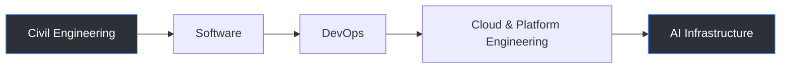

<picture>
  <source media="(prefers-color-scheme: dark)" srcset="https://capsule-render.vercel.app/api?type=waving&color=0:0F1220,100:1E3A5F&height=180&section=header&text=Ibrahim%20El%20Othmani&fontSize=38&fontColor=E6EDF3&animation=fadeIn&fontAlignY=38&desc=Cloud%20%C2%B7%20DevSecOps%20%C2%B7%20AI%20Infrastructure&descAlignY=58&descSize=15&descColor=9FB3C8">
  
</picture>

📍 Nabeul, Tunisia &nbsp;·&nbsp; 🌍 Open to remote — EU & MENA

## About

Started in **structural engineering** — load paths, safety factors, failure margins. Pivoted into software in 2023 and never lost the instinct: systems fail from unexamined assumptions, not bad code.

Today I build **multi-tenant SaaS platforms and the Kubernetes/Terraform infrastructure underneath them**, and I'm the founder of **Future Eagle IoT**. Currently deep in an AI/ML infrastructure transition — treating agents and RAG pipelines with the same rigor as any other production service.

## Tech Stack

 

 

 &nbsp;   

## Engineering Journey

## Featured Projects

| Project | Stack | What it does |
|---|---|---|
| [**AgentWarden**](https://github.com/ibrahimelothmani/AgentWarden)  | Go · K8s admission webhooks | Sandboxes AI coding agents inside Kubernetes — a policy layer between "agent suggests" and "agent executes." |
| [**FlexTier**](https://github.com/ibrahimelothmani/FlexTier-DevSecOps-Dual-Architecture-Java-Application-Orchestration-FinOps-on-AWS)  | Java · K3s · ECS Fargate | Migrates a legacy Java WAR two ways in parallel, with FinOps tagging to compare real cost trade-offs. |
| [**Blog-Platform-CloudOps**](https://github.com/ibrahimelothmani/Blog-Platform-CloudOps)  | Spring Boot · React · Terraform | Full-stack app with Docker, Jenkins, K8s, Prometheus & Grafana wired in from the first commit. |
| [**ticket-forge-devops**](https://github.com/ibrahimelothmani/ticket-forge-devops)  | Event-driven microservices | High-concurrency ticketing sandbox modeling flash-sale traffic patterns. |
| [**GitOps-on-k8s-using-ArgoCD**](https://github.com/ibrahimelothmani/GitOps-on-k8s-using-ArgoCD)  | Kubernetes · ArgoCD | Git as the single source of truth for cluster state — no `kubectl apply` from a laptop. |

**Private / proprietary:** **Future Eagle Fleet** (multi-tenant fleet SaaS — Spring Boot, PostgreSQL RLS, Keycloak) and **Eagle IoT** (industrial pipeline — PLC → ESP32 → Kafka → TimescaleDB).

## GitHub Activity

  

<!-- SNAKE-CONTRIBUTION-GRAPH:START -->

<!-- SNAKE-CONTRIBUTION-GRAPH:END -->

Streak card and snake animation activate once <code>profile-widgets.yml</code> is enabled on this repo (included below).

## Writing

Long-form notes on DevOps, DevSecOps, Cloud, MLOps & AIOps at [the blog](https://ibrahimelothmani-blog.netlify.app/) — including the **Engineering AI** and **TicketForge** book series, written alongside the projects above.

---

*A structure doesn't fail because of the math — it fails because of the assumption nobody checked. Same standard applies to distributed systems, and now to the agents running on top of them.*

&nbsp;

